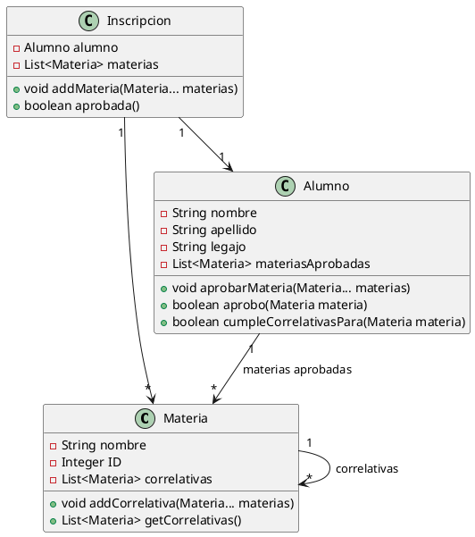

# Validador-correlativas

## 📘 Descripción

Este proyecto implementa un **Validador de Inscripciones** para materias con correlatividades, como suele suceder en planes de estudio de carreras universitarias o terciarias.

El objetivo es asegurar que un alumno pueda inscribirse únicamente si cumple con los requisitos académicos previos (correlativas) establecidos para cada materia.

---

## 🧠 Contexto

En carreras de nivel superior, algunas materias tienen como **correlativas** a otras que deben haber sido **aprobadas previamente**.  
Por ejemplo:

- **Algoritmos y Estructuras de Datos** → no tiene correlativas  
- **Paradigmas de Programación** → requiere tener aprobada *Algoritmos*  
- **Diseño de Sistemas** → requiere tener aprobada *Paradigmas*

Una inscripción a múltiples materias será válida **solo si el alumno cumple todas las correlativas** para cada una de ellas.

---

## ✅ Consigna

Teniendo en cuenta que:

- El método principal del presente módulo debe ser el método:
  ```java
  boolean Inscripcion.aprobada()
  ```

- Las inscripciones pueden involucrar **varias asignaturas**.

- La inscripción se **rechaza si al menos una materia** no cumple con la condición de correlatividades.

Y teniendo como **restricción** que solamente se podrán utilizar, además de la clase `Inscripcion`, la clase `Materia` y `Alumno`, se pide:

### 1. 🧩 Diseñar una solución en el Paradigma Orientado a Objetos
Se incluye un **diagrama UML** en este documento para representar las relaciones entre las clases y los métodos principales.

### 2. 💻 Codificar la solución en Java
El proyecto está implementado en Java 17 y sigue buenas prácticas de programación orientada a objetos.

### 3. 🧪 Crear los tests unitarios necesarios
Se incluyen pruebas con JUnit que permiten verificar el correcto funcionamiento del módulo.

---

## 🧱 Diagrama de Clases (UML)


