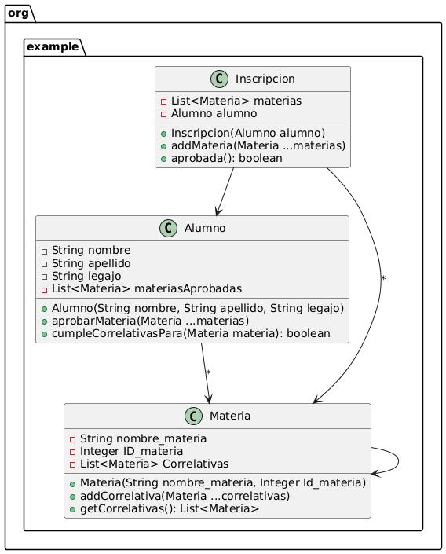

# Validador-correlativas

## 📘 Contexto

Nos han solicitado el diseño y el desarrollo de un Validador de Inscripciones según materias correlativas.  
En las carreras terciarias y universitarias, para ordenar el plan de estudios y asegurar que cuando se inicia una materia se tienen todos los conocimientos necesarios para entenderla, se establece lo que se llama comúnmente “materias correlativas”.  

Básicamente, son materias que hay que tener aprobadas antes de cursar la materia en cuestión.  
Por ejemplo, antes de cursar **Diseño de Sistemas** hay que cursar **Paradigmas de Programación**, y antes de ésta hay que cursar **Algoritmos y Estructuras de Datos**, donde esta última no tiene correlativas.

---

## 📌 Consigna

Teniendo en cuenta que:

- El método principal del presente módulo debe ser el método `boolean aprobada()` de la clase **Inscripción**  
- Las inscripciones pueden involucrar **varias asignaturas**  
- La inscripción se **rechaza si al menos una materia no cumple** con la condición de correlatividades  

Y teniendo como restricción que solamente se podrán utilizar, además de la clase **Inscripción**, la clase **Materia** y **Alumno**, se pide:

1. Diseñar una solución en el **Paradigma Orientado a Objetos** y comunicar la solución mediante un **Diagrama de Clases**.  
2. Codificar la solución en **Java**.  
3. Crear los **tests unitarios** que considere necesario para mostrar el correcto funcionamiento del módulo.

## 🧱 Diagrama de Clases (UML)

